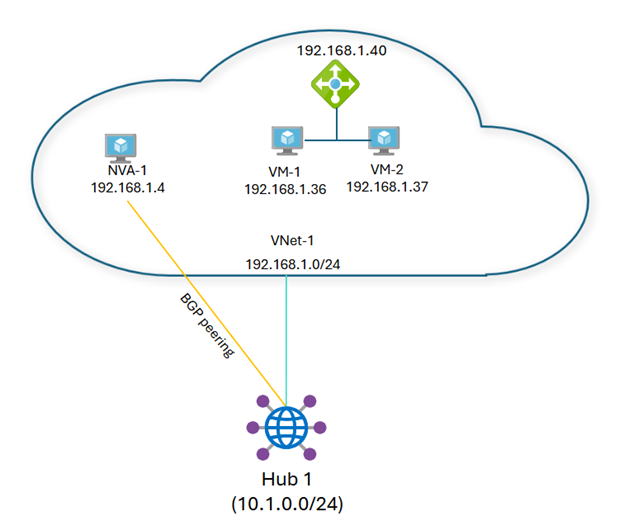

# Azure Virtual WAN Overview and the New “Next Hop IP” Feature

Azure Virtual WAN is a Microsoft cloud networking service that unifies many networking, security, and routing functions under a single, managed interface. In simple terms, Virtual WAN acts like a global network backbone in Azure, allowing you to easily connect your branch offices, on-premises data centers, remote users, and Azure virtual networks through centrally managed hubs. It supports multiple connection types (for example, site-to-site VPN, point-to-site VPN for remote users, and private links via Azure ExpressRoute) and ties them together with Azure’s high-speed backbone network. Think of it as an all-in-one cloud WAN: you get a hub-and-spoke architecture where the Azure-managed hub handles routing between all your “spokes” (branches, VPNs, VNets, etc.), making it easier to build a global transit network and apply security consistently.

## Introducing the “Next Hop IP” Feature in Azure Virtual WAN

One of the latest enhancements to Azure Virtual WAN is the **Next Hop IP support** (generally available as of April 2025). This new feature allows the Virtual WAN hub router to work with network virtual appliances (NVAs – e.g. firewall or router VMs) that are deployed behind an Azure Load Balancer. In technical terms, the Virtual WAN hub can now peer via BGP (Border Gateway Protocol) with an NVA even if that NVA isn’t directly exposed – the NVA can advertise routes where the “next hop” is the load balancer’s IP address (or another device) instead of the NVA’s own IP.

### Why is this useful?

Deploying NVAs behind a load balancer provides higher availability and load distribution for your traffic. Previously, it was difficult to integrate such a setup with Virtual WAN’s dynamic routing – you typically could not have the NVA tell the hub to send traffic to the load balancer. With Next Hop IP support, this becomes possible. The NVA peers with the Virtual WAN hub over BGP (just as before), but now it can advertise routes and specify a custom next-hop IP. For example, the NVA can say “to reach Network X, send the traffic to IP Y next” – where Y could be the IP of an internal load balancer in front of a cluster of NVAs. The hub will then forward traffic to that IP Y (the load balancer), which in turn distributes it to the NVA(s) behind it. This added indirection enables new design patterns for high availability and scaling of NVAs, all while maintaining dynamic route exchange with the Virtual WAN hub.

> **Illustration:**
> An example Azure Virtual WAN scenario with Next Hop IP. 

Here, “Hub 1” (Virtual WAN hub) is connected to a VNet (cloud) containing an NVA (`192.168.1.4`) and an internal load balancer (`192.168.1.40`). The NVA peers with the hub via BGP. With the Next Hop IP feature, the NVA can advertise a route (e.g. to the `10.222.222.0/24` network) with the load balancer’s IP (`192.168.1.40`) as the next hop. This means Hub 1 will send traffic for that network to the LB, which then forwards it to the NVA.

In short, Next Hop IP support lets Virtual WAN treat an intermediate device (like a load balancer) as the next hop for routes. This capability brings improved load balancing and connectivity options.

> **Note:** The next hop IP must be in the same Azure region – you can’t advertise a route to a next hop in a different region. But within a region/hub, you have full flexibility.

## Why “Next Hop IP” Was Needed: Solving Asymmetric Routing Challenges

The “Next Hop IP” feature was introduced to address some technical challenges in complex Azure network topologies, most notably asymmetric routing issues. **Asymmetric routing** is when a network packet takes one path to its destination but returns via a different path. In practice, asymmetrical paths can confuse network devices and security appliances. For instance, a firewall NVA might see traffic on the way out, but the return traffic bypasses it – causing the firewall to drop the response because it never saw the initial request. This situation is especially common in hub-and-spoke clouds when you have multiple possible routes or when using load-balanced NVAs without careful configuration.

Before this feature, if you tried to deploy two or more NVAs behind an Azure Load Balancer in a Virtual WAN environment, you might encounter asymmetrical routing. Example scenario: Traffic from an Azure VNet could go out through NVA-1, but on the way back, it might inadvertently come through NVA-2 or a different hub, if the routing wasn’t perfectly aligned. The Azure Virtual WAN hub didn’t natively understand that it should send all return traffic back through the load balancer to the same NVA cluster. The result?  Unpredictable paths, sessions dropping, and difficult troubleshooting.

Next Hop IP support directly mitigates this problem. By allowing the NVA to advertise routes with the load balancer as the next hop, the Virtual WAN hub can ensure both outbound and return traffic pass through the same point. In our example, with the NVA behind an LB, the NVA sets the LB’s IP as the next hop for routes it advertises. This means Azure’s hub will always route matching traffic to the LB (and thus to the NVA cluster) on the way out, and the return traffic from the NVA will go back via that same load balancer path to the hub. The path is symmetrical, passing through the LB/NVA for both directions. In essence, Next Hop IP gives you a way to pin the route’s egress and ingress to a specific device, solving the asymmetric routing that occurs when different paths were taken before. This leads to more consistent network flows and happy firewalls (no more seeing only half the conversation).

## Key Technical Benefits of Next Hop IP in Virtual WAN

The new Next Hop IP capability brings several technical benefits for Azure networking:

- **High Availability for NVAs:** You can now deploy NVAs in an active/active high-availability setup behind an Azure Load Balancer and still use dynamic routing with Virtual WAN. The hub accepts the load balancer as a next hop, so if one NVA instance goes down, another can seamlessly handle traffic (the LB will simply send traffic to the healthy instance). This eliminates single points of failure in the NVA design.
- **Elimination of Asymmetric Routing:** By controlling the exact next hop for a given route, you ensure traffic paths are consistent. This resolves the asymmetric routing issues that occurred when traffic’s return path didn’t go through the same device. Now, stateful firewalls and other NVAs can see both directions of traffic, which is crucial for security and proper functioning.
- **Better Load Balancing and Performance:** Since you can point routes to a load balancer, you effectively distribute network load across multiple NVAs. Azure Load Balancer will spread connections or flows among NVA instances, improving throughput and making use of scale-out architectures. Microsoft notes that deploying behind a load balancer can provide improved connectivity and performance.
- **Simplified Network Design:** Previously, complex workarounds (like user-defined static routes or manual BGP route tweaks) were needed to integrate load-balanced NVAs with Virtual WAN. Now it’s much more straightforward to design: the NVA’s BGP just tells the hub about routes and where to send them next, even if that’s an IP of another device. This reduces configuration complexity and the chance for mistakes. It’s a more “plug-and-play” integration for third-party appliances in Azure.
- **Flexibility in Routing Policies:** This feature complements other Virtual WAN routing features (such as route tables, route maps, etc.) by giving architects another tool to control traffic flow. For example, you might advertise certain routes from an NVA with the LB next hop and others with the NVA itself as next hop, depending on how you want traffic to traverse your network. It provides more granular control over how traffic enters/exits the Virtual WAN hubs.

> **Note:** Ensure that the next hop IP you configure is within the same region and network context. Cross-region next-hop advertisement is not supported, so you would handle cross-region routing using the usual hub-to-hub connections or other methods.

## Practical Impact and Summary of the Update

What does the Next Hop IP feature mean in practice? In a nutshell, it makes Azure Virtual WAN even more robust and easier to use for both cloud architects and network engineers. If you’re not a networking expert, here’s the takeaway: your company can run critical network appliances (like firewalls) in Azure with full redundancy and load balancing, without worrying that Azure’s network might send traffic the “wrong way” around those appliances. The result is more reliable and predictable connectivity. Applications see more consistent network performance, and administrators see fewer routing headaches.

From a technical perspective, this update fills a gap in Azure’s cloud networking capabilities. It solves a common pain point (asymmetric routing) that many experienced when integrating on-premises networks or complex NVA deployments with Virtual WAN. Now, with Next Hop IP support, Azure Virtual WAN can handle sophisticated routing scenarios that were previously challenging or impossible to configure with native tools.

---

**In summary:** Azure Virtual WAN continues to evolve as a one-stop solution for wide-area networking in the cloud. The Next Hop IP feature makes it friendlier to advanced scenarios by allowing load-balanced appliances and custom routing paths, all while keeping the configuration simple and centralized. For organizations, this means you can design a cloud network that is both high-performance and highly available, without needing deep networking tricks. It’s a clear win: easier architecture, stronger network reliability, and a more seamless integration of your security and routing appliances into Azure’s global network.

#Azure #Networking #Cloud #VirtualWAN #Microsoft